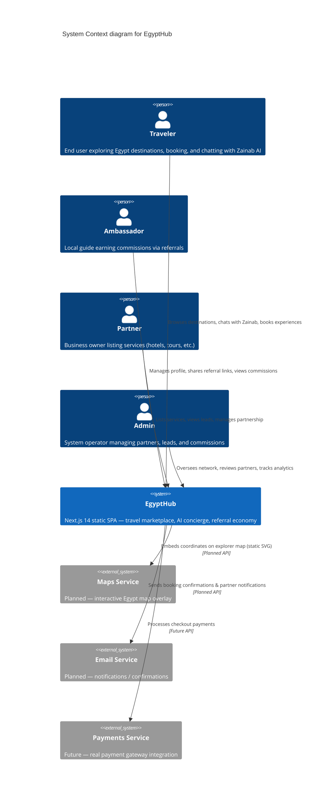
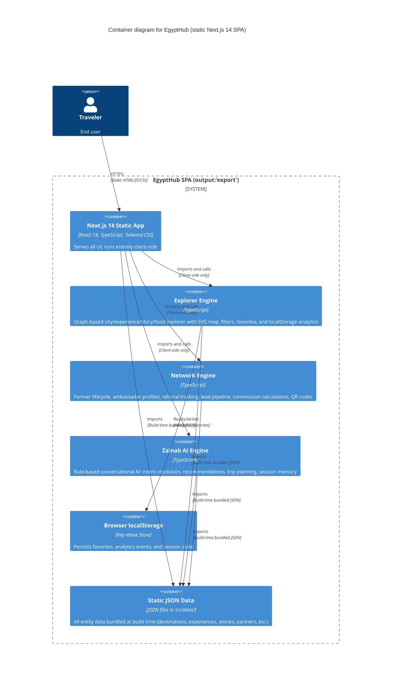

# C4 Architecture — EgyptHub (AS-IS)

## Level 1: System Context



## Level 2: Container Diagram



## Level 3: Component Diagram

```mermaid
C4Component
  title Component diagram — Explorer Engine, Network Engine, Zainab AI Engine

  System_Boundary(explorer, "Explorer Engine — src/lib/explorer/") {
    Component(ee, "explorerEngine.ts", "Builds graph (cities, experiences, stories, food, ambassadors), cross-links nodes by city/relation")
    Component(fe, "filterEngine.ts", "Memoized filter pipeline (types, categories, cities, price, difficulty, search)")
    Component(de, "deepLinkEngine.ts", "Encodes/decodes explorer state to URL params for shareable links")
    Component(ce, "cityExplorer.ts", "City immersion data: stats, related cities, all nodes per city")
    Component(ae, "analyticsTracker.ts", "localStorage-based event tracking (clicks, views, filters, favorites)")
    Component(ve, "favoritesEngine.ts", "localStorage CRUD for saved discoveries")
    Component(mdt, "mapDataTransformer.ts", "Lat/Lng → SVG projection, marker clustering")
    Component(rc, "recommendationConnector.ts", "Maps Zainab intent categories to Explorer nodes")
  }

  System_Boundary(network, "Network Engine — src/lib/network/") {
    Component(pe, "partnerEngine.ts", "CRUD + search/filter for business partners; data from src/data/network/partners.json")
    Component(ame, "ambassadorEngine.ts", "Ambassador profiles, search, referral code generation")
    Component(re, "referralEngine.ts", "Referral creation, stats, link generation, click tracking; data from referrals.json")
    Component(le, "leadPipelineEngine.ts", "Lead lifecycle (create, status transitions, history); data from leads.json")
    Component(ce2, "commissionEngine.ts", "Commission calculation (flat/percentage/tier) + lifecycle; data from commissions.json")
    Component(lae, "leadAttributionEngine.ts", "Source attribution chain (lead → ambassador → partner)")
    Component(qre, "qrEngine.ts", "QR code data generation + scan tracking")
    Component(ple, "partnerLifecycleEngine.ts", "Partner application workflow (draft → review → approve/reject/suspend)")
    Component(na, "networkAnalytics.ts", "Aggregated stats (partners, ambassadors, leads, revenue top cities/categories)")
  }

  System_Boundary(zainab, "Zainab AI Engine — src/lib/zainab/") {
    Component(ir, "intentResolver.ts", "Regex-based intent detection (15 intents: relaxation, adventure, culture, food, luxury, diving, etc.)")
    Component(re2, "recommendationEngine.ts", "Intent-based/city-based/category-based recommendations; memory-aware combination")
    Component(ce3, "conversationEngine.ts", "Session memory, welcome/greeting/goodbye flows, contextual response builder, trip plan trigger")
    Component(tp, "tripPlanner.ts", "Hardcoded itineraries for 7 cities; auto-generates fallback itineraries")
    Component(se, "suggestionEngine.ts", "City suggestions, keyword search on search-index.json, quick intent buttons")
  }

  Rel(ee, fe, "Feeds nodes for filtering")
  Rel(ee, mdt, "Feeds nodes for map markers")
  Rel(ee, ce, "Provides graph for immersion queries")
  Rel(ce3, ir, "Resolves user message to intent")
  Rel(ce3, re2, "Fetches recommendations by intent or city")
  Rel(ce3, tp, "Triggers trip plan generation")
  Rel(ce3, se, "Fetches city suggestions")
  Rel(re2, ir, "Maps intent to knowledgeKey")
  Rel(rc, ee, "Feeds Zainab recommendations into Explorer graph")
  Rel(re, ame, "Looks up ambassador by referral code")
  Rel(ce2, le, "Resolves lead for commission calc")
  Rel(ce2, pe, "Resolves partner for commission calc")
  Rel(lae, le, "Builds attribution chain")
  Rel(na, pe, "Gathers partner stats")
  Rel(na, ame, "Gathers ambassador stats")
  Rel(na, le, "Gathers lead funnel")
  Rel(na, ce2, "Gathers commission stats")
  Rel(ple, pe, "Submits partner applications")
  Rel(qre, re, "Creates referral on QR scan")
  Rel(qre, ame, "Resolves ambassador for QR data")
  Rel(ae, "localStorage", "Persists events")
  Rel(ve, "localStorage", "Persists favorites")
```

---

**Confidence Level: HIGH** — All engines, components, and data sources verified against source code at `src/lib/`, `src/data/`, `src/components/`, and `src/app/`.
