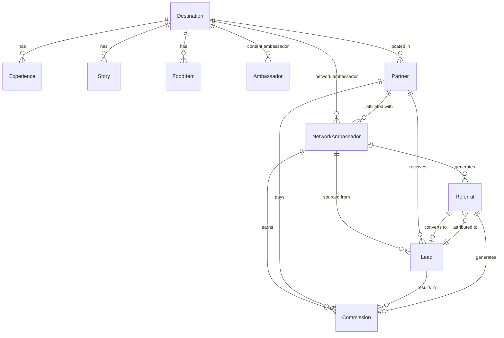

# EgyptHub Domain Model (AS-IS)

> Generated: 2026-06-23 | Source: actual type definitions and data files

## Bounded Contexts & Entities

### Explorer Context (src/lib/explorer/ + src/data/)

#### Destination
| Field | Type | Source |
|-------|------|--------|
| id | string | `destinations.json` (8 records) |
| slug | string | e.g. `"cairo"` |
| nameAr | string | Arabic name |
| nameEn | string | English name |
| shortDescription | string | ~80 char blurb |
| longDescription | string | Full paragraph |
| heroTitle | string | Landing headline |
| heroSubtitle | string | Tagline |
| famousFor | string[] | 4 key attractions |
| bestTimeToVisit | string | Seasonal advice |
| coordinates | `{lat, lng}` | GPS |
| highlights | string[] | 6 key POIs |

#### Experience
| Field | Type | Source |
|-------|------|--------|
| id | string | `experiences.json` (80 records) |
| citySlug | string | FK → Destination.slug |
| name | string | Arabic name |
| category | string | History, Culture, Food, Adventure, Relaxation |
| description | string | Full text |
| highlights | string[] | 4 bullet points |
| duration | string | Arabic: "3 ساعات" |
| difficulty | string | Easy, Moderate, Challenging |
| priceRange | string | منخفض, متوسط, مرتفع |

#### Story
| Field | Type | Source |
|-------|------|--------|
| id | string | `stories.json` (50 records) |
| citySlug | string | FK → Destination.slug |
| title | string | Arabic |
| excerpt | string | Blurb |
| category | string | Culture, Adventure, Food, History, Local Life |
| readTime | string | "5 دقائق" |
| content | string | Full narrative (long form) |

#### FoodItem
| Field | Type | Source |
|-------|------|--------|
| id | string | `food.json` (100 records) |
| citySlug | string | FK → Destination.slug |
| name | string | Arabic dish name |
| cuisine | string | Street Food, Egyptian, Café |
| description | string | Full description |
| priceRange | string | منخفض, متوسط, مرتفع |

#### Ambassador (content layer)
| Field | Type | Source |
|-------|------|--------|
| id | string | `ambassadors.json` (32 records) |
| name | string | Arabic |
| citySlug | string | FK → Destination.slug |
| role | string | Local Guide, Photographer, Cultural Expert, etc. |
| bio | string | Arabic bio |
| languages | string[] | e.g. Arabic, English, French |
| specialties | string[] | e.g. السياحة التاريخية |
| isVerified | boolean | |

### Network Context (src/lib/network/ + src/data/network/)

#### NetworkAmbassador
| Field | Type | Source |
|-------|------|--------|
| id | string | `network/ambassadors.json` (100 records) |
| name / nameEn | string | Bilingual |
| city | string | FK → Destination.slug |
| bio / bioEn | string | Bilingual |
| role | string | Local Guide, Photographer, etc. |
| specialties | string[] | Service tags |
| languages | string[] | e.g. Arabic, English, French |
| rating | number | 1-5 |
| verified | boolean | |
| referralCode | string | e.g. `EGY-AMB-0001` |
| totalReferrals | number | Counter |
| totalLeads | number | Counter |
| totalConversions | number | Counter |
| avatarUrl | string | `/images/avatars/avatar-01.svg` |
| socialLinks | `{instagram?, facebook?}` | Optional URLs |

#### Partner
| Field | Type | Source |
|-------|------|--------|
| id | string | `network/partners.json` (50 records) |
| name / nameEn | string | Bilingual |
| category | PartnerCategory | Hotel, Resort, Restaurant, Dive Center, Tour Operator, Transportation, Shopping, Experience Provider |
| city | string | |
| description / descriptionEn | string | Bilingual |
| contactEmail / contactPhone | string | |
| website | string | |
| address | string | |
| coordinates | `{lat, lng}` | GPS |
| status | PartnerStatus | `draft` \| `pending-review` \| `approved` \| `rejected` \| `suspended` \| `archived` |
| featured | boolean | |
| rating | number | |
| totalLeads / totalReferrals | number | Counters |
| services | string[] | Arabic service tags |
| gallery | string[] | Image paths |
| ambassadorIds | string[] | FK → NetworkAmbassador |

#### Lead
| Field | Type | Source |
|-------|------|--------|
| id | string | `network/leads.json` (30 records) |
| source | LeadSource | `explorer` \| `zainab` \| `referral` \| `direct` \| `partner-page` |
| ambassadorId | string\|null | FK → NetworkAmbassador |
| partnerId | string\|null | FK → Partner |
| status | LeadStatus | `new` \| `contacted` \| `qualified` \| `proposal-sent` \| `converted` \| `closed` \| `lost` |
| clientName / clientEmail / clientPhone | string | |
| clientNotes | string | |
| destination | string | |
| budget | BudgetLevel | `low` \| `medium` \| `high` |
| timeline | string | |
| history | LeadTimelineEvent[] | Action trail |

#### Referral
| Field | Type | Source |
|-------|------|--------|
| id | string | `network/referrals.json` (20 records) |
| ambassadorId | string | FK → NetworkAmbassador |
| referralCode | string | |
| type | ReferralType | `click` \| `visit` \| `lead` \| `conversion` |
| source | ReferralSource | `qr` \| `link` \| `widget` |
| destination | string | City slug |
| targetPage | string | URL path |
| leadId | string\|null | FK → Lead |
| commissionId | string\|null | FK → Commission |

#### Commission
| Field | Type | Source |
|-------|------|--------|
| id | string | `network/commissions.json` (20 records) |
| leadId | string | FK → Lead |
| ambassadorId | string | FK → NetworkAmbassador |
| partnerId | string | FK → Partner |
| type | CommissionType | `flat` \| `percentage` \| `tier` |
| amount | number | USD |
| currency | string | "USD" |
| status | CommissionStatus | `pending` \| `approved` \| `paid` \| `cancelled` |
| referenceId | string | e.g. `booking-MT-2026-001` |
| notes | string | |
| paidAt | string\|null | ISO date |

#### NetworkSettings
| Fields | Type | Notes |
|--------|------|-------|
| commissionRates | `{flat, percentage, tier}` | Configured but not actively computed |
| maxFeaturedPartners | number | |
| currency | string | "USD" |
| platformFee | `{type, value}` | |

### AI Context (src/lib/zainab/ + src/data/)

#### KnowledgeIntent
| Field | Type |
|-------|------|
| title | string |
| description | string |
| recommendedCities | string[] |
| recommendedExperiences | string[] |
| advice | string |

#### TravelRoute
| Field | Type |
|-------|------|
| id | string |
| name | string |
| description | string |
| cities | string[] |
| duration | string |
| bestFor | string[] |

#### ChatMessage
| Field | Type |
|-------|------|
| id | string |
| role | `user` \| `zainab` |
| content | string |
| recommendations? | Recommendations |
| tripPlan? | TripPlan |
| timestamp | number |

#### TripPlan
| Field | Type |
|-------|------|
| city | Destination |
| days | TripPlanDay[] |
| totalDuration | string |

#### SessionMemory
| Field | Type |
|-------|------|
| preferredCity? | string |
| preferredActivities | string[] |
| knownIntents | string[] |
| mentionedCities | string[] |

### Booking Context (src/app/booking/)
No backend types — UI shell only (page.tsx, checkout/, confirmation/, details/)

### Identity Context
No User, Auth, or Profile types found. Pages exist (`auth/login`, `auth/register`, `profile/`) but no types defined.

---

## Entity Relationship Diagram (Mermaid)

## Relationships Summary

| From | To | Type | Cardinality | Key |
|------|----|------|-------------|-----|
| Destination | Experience | FK | 1:N | citySlug |
| Destination | Story | FK | 1:N | citySlug |
| Destination | FoodItem | FK | 1:N | citySlug |
| Destination | Ambassador | FK | 1:N | citySlug |
| Partner | NetworkAmbassador | array FK | N:M | ambassadorIds |
| NetworkAmbassador | Referral | imp FK | 1:N | ambassadorId |
| NetworkAmbassador | Lead | imp FK | 1:N | ambassadorId |
| NetworkAmbassador | Commission | imp FK | 1:N | ambassadorId |
| Lead | Referral | imp FK | 1:1 | leadId |
| Lead | Commission | imp FK | 1:1 | leadId |
| Referral | Commission | imp FK | 1:1 | commissionId |

> **Note:** All relationships are "soft" (no DB constraints) — JSON data with matching ID strings. Explorer engine (`explorerEngine.ts`) builds the graph by joining on `citySlug` in memory.

## Missing Domain Entities
- **User / Traveler** — No type defined. Auth pages exist but auth is a shell.
- **Booking** — No type defined. Booking pages exist but are UI only.
- **Payment** — No type. Payment page exists shell only.
